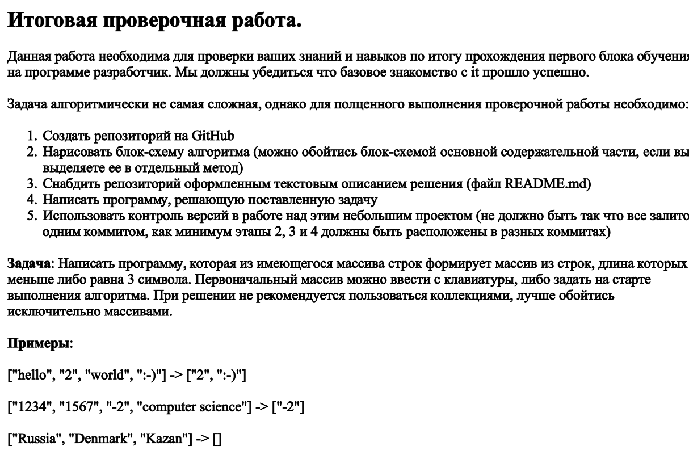

# Итоговое задание 

* Задание № 1 Репозиторий создан. Отправлен ссылкой как решения контрольной.
* Задание № 2 
* Задание № 3 Создание README, которое вы сейчас читаете.
* Задание № 4  [Final](Final/Program.cs) В этом файле задаем массив строк - заданный [в задании](%D0%9A%D0%BE%D0%BD%D1%82%D1%80%D0%BE%D0%BB%D1%8C%D0%BD%D0%B0%D1%8F.png).Выводим на экран только те элементы в которых количество символов больше 3. С помощью цикла for и условия if.
* Задание 5 Можете проверить с помощью команды git log --pretty=oneline (для удобства)
## Спасибо за 1 четверть